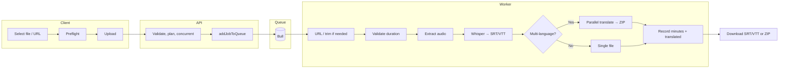
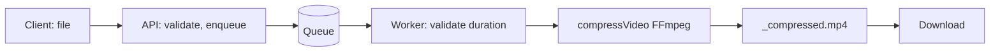
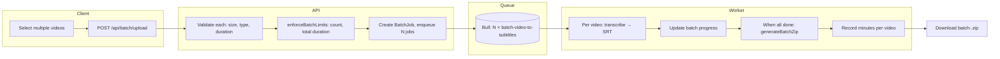

# VideoText architecture

This document describes the **upload → queue → worker → download** pipeline, how **tier limits** affect behaviour (e.g. concurrent jobs, queue routing), and detailed flows per tool. Use it to reason about changes such as “Pro = 2 concurrent jobs” or “120 min / 10 GB file for Pro”.

**Source of truth for limits:** `server/src/utils/limits.ts`  
**Queue config:** `server/src/utils/queueConfig.ts`  
**Worker:** `server/src/workers/videoProcessor.ts`  
**Upload routes:** `server/src/routes/upload.ts`, `server/src/routes/batch.ts`

---

## 1. Tier limits that affect architecture

These limits directly shape request handling, queue choice, and worker behaviour.

| Tier   | Max concurrent jobs | Max video duration | Max file size | Queue routing (when total queue > 50) | Max job runtime* |
|--------|----------------------|--------------------|---------------|----------------------------------------|------------------|
| **Free**   | 1 | 15 min  | 2 GB  | Normal queue only   | 10 min |
| **Basic**  | 1 | 45 min  | 5 GB  | Normal queue only   | 15 min |
| **Pro**    | **2** | 120 min | 10 GB | Priority queue (Pro/Agency) | 30 min |
| **Agency** | **3** | 240 min | 20 GB | Priority queue (Pro/Agency) | 45 min |

\*Max job runtime is enforced only when total queue length ≥ 20; see worker tier-aware runtime.

- **Max concurrent jobs:** Per user. API checks `active + waiting` jobs for that `userId` before accepting upload or dual (burn). If at cap (e.g. Pro = 2), returns `429 MAX_CONCURRENT_JOBS_REACHED`.
- **Queue routing:** When `getTotalQueueCount() > PAID_TIER_RESERVATION_QUEUE_THRESHOLD` (50), Pro and Agency jobs go to **priority queue**; others go to **normal queue**. Priority queue gets dedicated worker(s).
- **Worker concurrency:** Normal queue: `WORKER_NORMAL_CONCURRENCY` (default 2). Priority queue: `WORKER_PRIORITY_CONCURRENCY` (default 1). So by default, 2 workers serve all tiers on the normal queue; 1 worker serves Pro/Agency when queue > 50.

---

## 2. High-level pipeline

All tools (except in-app translation and some GETs) follow the same backbone:

```
┌─────────────┐     ┌─────────────┐     ┌─────────────┐     ┌─────────────┐     ┌─────────────┐
│   Client    │────▶│  API        │────▶│  Redis      │────▶│  Worker     │────▶│  Download   │
│   (React)   │     │  (Express)  │     │  (Bull)     │     │ (processor) │     │  (API)      │
└─────────────┘     └─────────────┘     └─────────────┘     └─────────────┘     └─────────────┘
      │                     │                     │                     │
      │  POST /api/upload   │  addJobToQueue()   │  processJob()       │  GET /api/download/:file
      │  or /upload/dual    │  (plan → normal or │  switch(toolType)   │
      │  or /batch/upload   │   priority queue)  │  → tool pipeline    │
      ▼                     ▼                     ▼                     ▼
   Chunked or           Validate size,         Job waits then       Client polls
   single file          duration, plan,        runs (extract,        job status,
   (multipart)           concurrent jobs       Whisper, FFmpeg…)     then downloads
```

---

## 3. Example: Pro user uploads 120 min / 10 GB (at limit)

This is the **maximum allowed for Pro** (120 min, 10 GB). How it moves through the pipeline:

1. **Client:** User selects file (120 min, 10 GB). Preflight checks duration and size against Pro limits (client-side). File is large → **chunked upload** (e.g. 10 MB chunks, parallel or sequential depending on connection).
2. **API (chunked):** `POST /api/upload/init` → `POST /api/upload/chunk` (×N) → `POST /api/upload/complete`. On complete: assemble file to disk, validate type/size/duration with `getPlanLimits('pro')`, enforce **max concurrent jobs** (Pro = 2): if this user already has 2 active/waiting jobs → 429. Check monthly minutes. Optionally duplicate/cache check; then `addJobToQueue('pro', { toolType, filePath, ... })`.
3. **Queue:** Total queue count &gt; 50? → job goes to **priority queue**; else **normal queue**. Job priority from `getJobPriority('pro')` (higher than free/basic).
4. **Worker:** Picks job from queue. `processJob()` runs `switch (toolType)`. For **video-to-transcript** or **video-to-subtitles**: validate duration again (plan limits), optional trim, **extract audio** (FFmpeg), then Whisper; for transcript optionally summary/chapters/exports. Progress updates and tier-aware **max runtime** (Pro = 30 min) apply when queue ≥ 20. On success: write output to temp dir, record usage (minutes), return `downloadUrl` + `fileName`.
5. **Client:** Polls `GET /api/job/:jobId`. When `status === 'completed'`, downloads via `GET /api/download/:filename`.

So for a **120 min / 10 GB** Pro file: upload (chunked) → API validates against Pro limits and concurrent cap (2) → job enqueued (normal or priority by queue depth) → worker runs one of the tool pipelines below → user gets transcript or subtitles (and is charged 120 minutes).

---

## 4. Pipeline by tool (mindmap-style)

Each tool shares: **API validates** (size, duration, plan, concurrent jobs) → **enqueue** → **worker** runs that tool’s branch → **output** written under `TEMP_FILE_PATH` → **download** URL returned.

### 4.1 Video → Transcript

```mermaid
flowchart LR
  subgraph Client
    A[Select file / URL] --> B[Preflight: duration, size]
    B --> C[Upload: single or chunked]
  end
  subgraph API
    C --> D[Multer / chunk assemble]
    D --> E[Plan limits: size, duration, concurrent]
    E --> F[Duplicate check optional]
    F --> G[addJobToQueue]
  end
  subgraph Queue
    G --> Q[(Bull: normal or priority)]
  end
  subgraph Worker
    Q --> W1[Download URL if needed]
    W1 --> W2[Trim if start/end]
    W2 --> W3[Validate duration]
    W3 --> W4[Extract audio]
    W4 --> W5[Whisper → transcript]
    W5 --> W6[Summary / chapters / exports]
    W6 --> W7[Write TXT or ZIP]
    W7 --> W8[Record minutes, cache]
  end
  W8 --> DL[GET /api/download/:file]
```



- **Entry:** `POST /api/upload` (file or URL), `toolType: 'video-to-transcript'`.
- **Worker:** `video-to-transcript`: optional URL download, trim, `validateVideoDuration(plan)`, `extractAudio` → Whisper (simple or verbose/diarization), then summary/chapters, export TXT/JSON/DOCX/PDF, ZIP if multiple. Minutes charged; cache saved if `videoHash` present.

### 4.2 Video → Subtitles



- **Entry:** `POST /api/upload`, `toolType: 'video-to-subtitles'`. Multi-language limited by plan (Basic: 2, Pro: 5, Agency: 10).
- **Worker:** Same video path → extract audio → Whisper → SRT/VTT; if `additionalLanguages`, multi-language outputs then ZIP. Minutes + translated minutes metering.

### 4.3 Burn subtitles (dual upload)


- **Entry:** `POST /api/upload/dual`, fields `video` + `subtitles`, `toolType: 'burn-subtitles'`.
- **Worker:** `burn-subtitles`: `filePath` = video, `filePath2` = subtitle file; optional trim; FFmpeg burn; output `_subtitled.mp4`. Minutes charged.

### 4.4 Compress video



- **Entry:** `POST /api/upload`, `toolType: 'compress-video'`. Options: `compressionLevel`, `compressProfile`.
- **Worker:** `compress-video`: validate duration, FFmpeg compress, return download URL. No minute charging for compress.

### 4.5 Translate / Fix / Convert subtitles (subtitle-only input)


- **translate-subtitles:** `translateSubtitleFile()` → new SRT/VTT. Translation minutes cap (Pro/Agency) enforced.
- **fix-subtitles:** `fixSubtitleFile()` → `_fixed.srt` / `_fixed.vtt`.
- **convert-subtitles:** `convertSubtitleFile()` → SRT/VTT/TXT. No minute charging.

### 4.6 Batch processing (Pro/Agency)



- **Entry:** `POST /api/batch/upload`, field `files`. Batch allowed only if `user.limits.batchEnabled` (Pro/Agency). Enforces `batchMaxVideos` and `batchMaxDuration` (e.g. Pro: 20 videos, 60 min total).
- **Worker:** Each job is `batch-video-to-subtitles`: one video → Whisper → SRT; batch model updated; when all jobs complete, `generateBatchZip()` builds `batch-<id>.zip` (and `error_log.txt` if any failed).

---

## 5. Queue and worker summary

| Component | Detail |
|-----------|--------|
| **Queues** | `file-processing` (normal), `file-processing-priority` (Pro/Agency when queue &gt; 50). Both use same Redis. |
| **Concurrency** | Normal: 2 (env `WORKER_NORMAL_CONCURRENCY`). Priority: 1 (env `WORKER_PRIORITY_CONCURRENCY`). |
| **Per-user concurrency** | Free/Basic: 1 job at a time; Pro: 2; Agency: 3. Enforced at upload (single, dual, chunked complete) and batch. |
| **Job priority** | Free 1, Basic 5, Pro 10, Agency 20. Higher priority jobs are picked first within the same queue. |
| **Tier-aware runtime** | When total queue ≥ 20, job is limited to `getMaxJobRuntimeMinutes(plan)` (Free 10, Basic 15, Pro 30, Agency 45). Rechecked every 15 s. |

---

## 6. Where limits and pipeline are implemented

| Concern | Location |
|--------|----------|
| Plan limits (duration, size, concurrent, batch) | `server/src/utils/limits.ts` |
| Upload: single file | `server/src/routes/upload.ts` → `upload.single('file')`, then `addJobToQueue` |
| Upload: chunked | `server/src/routes/upload.ts` → init/chunk/complete, assemble → `addJobToQueue` |
| Upload: dual (burn) | `server/src/routes/upload.ts` → `upload.fields([video, subtitles])`, then `addJobToQueue` |
| Batch upload | `server/src/routes/batch.ts` → validate, `enforceBatchLimits`, N× `addJobToQueue(..., batch-video-to-subtitles)` |
| Queue choice (normal vs priority) | `server/src/workers/videoProcessor.ts` → `addJobToQueue(plan, data)` |
| All tool pipelines | `server/src/workers/videoProcessor.ts` → `processJob()` → `switch (toolType)` |
| Duration/size validation in worker | `validateVideoDuration(videoPath, limits.maxVideoDuration)`; size checked at API. |

For **tier limits in one place** (including for documentation and testing), see the [Tier limits](README.md#tier-limits) table in the README and `server/src/utils/limits.ts`.
